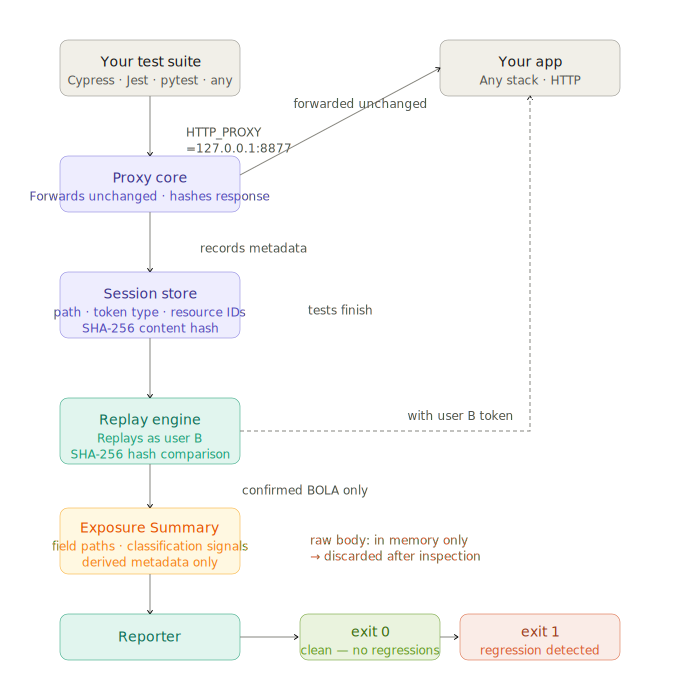

# jabearri


**Confirmed unauthorized data replay detection from real authenticated traffic.**

Broken access control remains the most common high-impact API vulnerability. Existing scanners can't reliably catch it — they don't have authenticated context. They've never logged into your app.

Your test suite has that context. jabearri uses it.

---

## Try it now

```bash
git clone https://github.com/rodrigo-areyzaga/jabearri
cd jabearri
node demo.js
```

No install. No config. No accounts. Under 90 seconds from clone to first finding.

---

## What it does

jabearri confirms one high-confidence failure mode: user B receiving the same protected resource representation originally observed under user A, using authenticated traffic your tests already generate.

```
GET /api/orders/ord-1001
Authorization: Bearer alice-token
→ {"orderId":"ord-1001","item":"Keyboard","total":149.99}

Replayed as Bob:
GET /api/orders/ord-1001
Authorization: Bearer bob-token
→ {"orderId":"ord-1001","item":"Keyboard","total":149.99}

HIGH — authorization regression — broken access control (OWASP A01)
       Mechanism: confirmed unauthorized data replay
       GET /api/orders/ord-1001
       curl -s -H 'Authorization: Bearer '$TOKEN_B '.../api/orders/ord-1001'
```

Bob received structurally identical authenticated data to Alice. The endpoint may be missing an ownership check.

This is confirmed unauthorized data replay detection: run it on every commit, catch the moment an ownership check breaks before it reaches production.

---

## How it works

1. jabearri starts as a local HTTP proxy on port `8877`
2. Your tests run normally — jabearri silently records every authenticated request
3. When tests finish, jabearri replays each request using a second user's token
4. Any endpoint that returns structurally identical authenticated data to a different user is flagged

No changes to your test code. No new testing concepts. One config file.



### How confirmation works — deterministic, not heuristic

jabearri doesn't estimate or guess. The detection is a hash comparison:

```
Alice's response:
  SHA256(normalised JSON) = 9af31c2d...

Bob's replay:
  SHA256(normalised JSON) = 9af31c2d...

Match → identical authenticated data exposure
```

For each replayed request jabearri:

1. Parses the response as JSON
2. Normalises key order recursively — `{"b":2,"a":1}` and `{"a":1,"b":2}` hash identically
3. Computes `SHA256(JSON.stringify(sortKeys(parsed)))`

The hashes either match or they don't. There is no scoring, no threshold, no grey area. If they match, user B received exactly what user A received. That is a confirmed unauthorized data replay.

For non-JSON responses it falls back to a raw byte hash. Body size is never used as a signal.

**Scope:** jabearri detects endpoints that return structurally identical authenticated data to a different user. Partial information leaks and structurally different but unauthorized responses require manual review. The tool prioritises precision — one confirmed finding you can trust is worth more than ten warnings you have to triage.

### Known scope limitations

A few edge cases worth knowing before you integrate:

**axios doesn't respect `HTTP_PROXY` by default.** If your test suite uses axios, you need to configure the proxy explicitly:
```javascript
const axios = require('axios');
const { HttpProxyAgent } = require('http-proxy-agent');
const agent = new HttpProxyAgent('http://127.0.0.1:8877');
axios.defaults.httpAgent = agent;
```
Or set the proxy directly in your axios config per request.

**Playwright doesn't use `HTTP_PROXY` by default.** Configure the proxy explicitly in your Playwright config:
```javascript
// playwright.config.js
module.exports = {
  use: {
    proxy: { server: 'http://127.0.0.1:8877' },
  },
};
```
Or per-browser in your test setup:
```javascript
const browser = await chromium.launch();
const context = await browser.newContext({
  proxy: { server: 'http://127.0.0.1:8877' }
});
```

**`204 No Content` responses are not flagged.** Some APIs return `204` with no body on successful resource access. jabearri requires a non-empty response body to confirm a finding — a `204` replay will not be reported even if user B should not have access. These endpoints require manual verification.

**Multi-user test suites.** If your test suite exercises more than two users, jabearri records all of their traffic but replays everything with a single `JABEARRI_TOKEN_B`. Requests made by user C will be replayed as user B, which may not reflect the access boundary you want to test. Document your expected principal pairs explicitly in your test config.

**jabearri models identity through authorization credentials only.** Applications using additional tenant-isolation headers — such as `X-Tenant-ID`, `X-Org-ID`, or custom routing metadata — may not be fully covered by token-swap replay alone. If your app uses secondary isolation mechanisms beyond bearer tokens or session cookies, those endpoints require additional manual verification.

**Responses with volatile fields may not be flagged.** If API responses include fields that change per-request — timestamps, trace IDs, request UUIDs, nonces — the normalized JSON hashes will differ between user A and user B even when the underlying data is identical. This is an intentional tradeoff: determinism over recall. A future configuration option (`ignoreKeys`) is planned for teams whose APIs include volatile metadata fields.

**Windows: `node` not recognized in PowerShell.** If you get `node: command not found` after installing Node.js, close and reopen PowerShell. If that doesn't work, refresh PATH without reopening:
```powershell
$env:PATH = [System.Environment]::GetEnvironmentVariable("PATH","Machine") + ";" + [System.Environment]::GetEnvironmentVariable("PATH","User")
```
Then run `npm run test:all` again.

**Node.js native `fetch` (undici) does not honor `HTTP_PROXY`** and will bypass the proxy silently. If your test suite uses `fetch` directly or via a library that wraps undici, requests will not be recorded. Use `node-fetch` with explicit agent configuration, or switch to `axios` with proxy config for the test client:
```javascript
// node-fetch with proxy
const { HttpProxyAgent } = require('http-proxy-agent');
const fetch = require('node-fetch');
const agent = new HttpProxyAgent('http://127.0.0.1:8877');
fetch(url, { agent });
```

**Some environments bypass proxies for localhost by default.** If requests are not being recorded, try setting `NO_PROXY` to empty or using `--noproxy` explicitly:
```bash
# curl
curl --noproxy "" --proxy http://127.0.0.1:8877 http://localhost:3000/api/orders

# Node.js / npm test
NO_PROXY="" HTTP_PROXY=http://127.0.0.1:8877 npm test
```

**Repeated endpoint calls are deduplicated.** If your test suite calls `GET /api/orders/1001` fifteen times (setup, assertions, teardown), jabearri records all fifteen but replays once. One finding per unique endpoint — not fifteen.

### Token type awareness

jabearri records how each token was delivered — `Authorization: Bearer` header or session cookie — and replays using the same mechanism. Rails apps using `session=` cookies, Django apps using `sessionid=`, and Bearer token APIs all work correctly without configuration.

### Clean runs are meaningful

When jabearri finds nothing, it tells you what it checked:

```
✓  No authorization regressions detected.

   42 replay candidates checked across 7 unique resource patterns.
   No unauthorized data replays found.
```

That's not silence — it's verification. You know the tool exercised real authenticated flows, not just that it ran quietly.

---

## Works with

**Any backend stack** — Node.js, Rails, Django, Laravel, Spring. If it serves HTTP, jabearri watches it.

**Mobile app backends** — The access control lives in the API, not the device. Point your API-level test suite through jabearri and it catches authorization regressions in your iOS or Android backend the same way it would for a web app.

**Any test runner** can be used as a traffic source — Cypress, Playwright, Jest, pytest, RSpec, curl scripts — as long as its HTTP traffic is routed through the jabearri proxy. Some runners require explicit proxy configuration (see troubleshooting below).

---

## Setup

```bash
git clone https://github.com/rodrigo-areyzaga/jabearri
cd jabearri
npm run test:all   # confirm all tests pass
```

Create `jabearri.config.json` in your project root:

```json
{
  "target": "http://localhost:3000",
  "port": 8877,
  "scope": ["/api/"],
  "exclude": ["/api/health", "/api/public/"],
  "outputFile": "jabearri-report.json"
}
```

---

## Running with your tests

### Option A — wrapper mode (recommended)

jabearri can wrap your test command directly. It starts the proxy, runs your tests with `HTTP_PROXY` injected automatically, then replays when the tests finish. No manual coordination required.

```bash
JABEARRI_TOKEN_B="second-user-token" node src/cli.js run -- npm test
```

With Cypress:

```bash
JABEARRI_TOKEN_B="second-user-token" node src/cli.js run -- npx cypress run
```

With pytest:

```bash
JABEARRI_TOKEN_B="second-user-token" node src/cli.js run -- pytest tests/
```

The syntax is `jabearri run -- <your test command>`. jabearri exits when your tests finish and outputs findings immediately after.

> **Note:** `JABEARRI_TOKEN_B` is not passed to your test command — it is only used internally by jabearri for replay. Your test code never sees Bob's token.

### Option B — manual mode (two terminals)

```bash
# Terminal 1 — start jabearri
JABEARRI_TOKEN_B="second-user-token" node src/cli.js

# Terminal 2 — run your tests through the proxy
HTTP_PROXY=http://127.0.0.1:8877 npm test

# Ctrl+C in Terminal 1 when tests finish
```

---

## CI integration

### CI with wrapper (one step)

```yaml
- name: Start app
  run: npm start &

- name: Run tests with jabearri
  run: node src/cli.js run -- npm test
  env:
    JABEARRI_TOKEN_B: ${{ secrets.TEST_USER_B_TOKEN }}
```

jabearri starts the proxy, runs `npm test` with `HTTP_PROXY` injected, replays when tests finish, and exits. One step, no coordination.

### CI with manual flush (multi-step)

```yaml
- name: Start app
  run: npm start &

- name: Start jabearri
  run: node src/cli.js &
  env:
    JABEARRI_TOKEN_B: ${{ secrets.TEST_USER_B_TOKEN }}

- name: Run tests
  run: HTTP_PROXY=http://127.0.0.1:8877 npm test

- name: Flush jabearri
  run: curl -s -X POST http://127.0.0.1:8877/--flush
```

jabearri exits with code `1` if authorization regressions are detected, `0` if clean. The CI step fails automatically when an ownership boundary is violated.

To preserve the report as a downloadable CI artifact — including on failed runs:

```yaml
- name: Save jabearri report
  uses: actions/upload-artifact@v4
  with:
    name: jabearri-report
    path: jabearri-report.json
  if: always()
```

The `if: always()` is important — without it, the artifact is skipped when jabearri exits with code `1`, which is exactly the run you most want to keep.

---

## What findings look like

```
────────────────────────────────────────────────────────────────
  jabearri — authorization regression results
────────────────────────────────────────────────────────────────
  Requests observed    : 42
  Replay candidates    : 19
  Resource patterns    : 7
  Auth mechanisms      : bearer
  Findings             : 1
────────────────────────────────────────────────────────────────

  [1] HIGH — broken access control (OWASP A01)
      Finding ID   — AG-20260610T183012Z-001
      Mechanism    — ✓ confirmed unauthorized data replay
      GET /api/orders/ord-1001
      Resource IDs : 1001, ord-1001
      Auth type    : bearer
      User A got   : 200 (98 bytes)
      User B got   : 200 (98 bytes)

      Why flagged:
        · Same endpoint replayed under a different authenticated user
        · Response hashes matched after JSON normalisation
        · SHA256(normalised JSON) identical for both principals

      Exposure Summary:
        Fields exposed : id, owner, item, total, status
        Signals        : resource_identifier, possible_financial
          id → resource_identifier
          total → possible_financial
        Raw body stored: no
        Raw values     : no
        Evidence hash  : json:2c913a03...

      Reproduce:
      curl -s -H 'Authorization: Bearer '$TOKEN_B 'http://localhost:3000/api/orders/ord-1001'

1 authorization regression detected.
Each finding is deterministic — hashes either match or they don't.
```

---

## Exposure Summary

For confirmed broken-access-control findings, jabearri summarises which response field paths were exposed to the replay user.

The Exposure Summary inspects response bodies while they are already in memory during replay. It does not persist response bodies.

**jabearri stores:**
- Sanitized field paths (e.g. `owner`, `email`, `balance`)
- Content type and body size
- Evidence hash (the SHA-256 hash that proved the match)
- Conservative classification signals (field-name-based)

**jabearri does not store:**
- Raw response bodies
- Raw field values
- Raw tokens
- Sensitive or dynamic JSON object keys — emails, UUIDs, tokens, long numeric IDs, and high-entropy strings used as keys are replaced with inert placeholders (`[email-key]`, `[uuid-key]`, `[token-like-key]`, `[numeric-key]`, `[dynamic-key]`, `[unsafe-key]`) before being stored as field-path segments

Schema field names (`email`, `vehicleId`, `latitude`, `accountId`) are kept unchanged and classified normally — only key segments that look like concrete runtime data are sanitized, so the exposure shape stays useful.

Responses larger than 1 MB skip exposure analysis (the body is already in memory from replay, but parsing and walking a very large body is an avoidable second cost). When skipped, the confirmed finding is still reported with an exposure summary marked `skipped: true, reason: "body-too-large"`.

Classification signals are field-name-based only. A signal like `email → possible_pii` means "the field name matches a known PII pattern." It does not mean "a specific email address was leaked." The distinction between fact and signal is load-bearing.

**Signal categories:**

| Category | Matches |
|---|---|
| `possible_pii` | email, username, firstName, lastName, phone, ssn, dob |
| `possible_location` | lat, latitude, lng, longitude, address, city, zip |
| `resource_identifier` | id, uuid, userId, accountId, orderId |
| `possible_financial` | balance, card, payment, iban, amount, total |
| `possible_secret` | password, secret, apiKey, token, privateKey |

Exposure Summary is enabled by default for confirmed findings. It runs only on JSON responses and only after the hash comparison has already confirmed the authorization failure. It does not affect detection or pass/fail behavior.

**Sample JSON report finding with Exposure Summary:**

```json
{
  "findingId": "AG-20260610T183012Z-001",
  "severity": "high",
  "type": "broken-access-control",
  "confidence": "confirmed",
  "method": "GET",
  "path": "/api/orders/ord-1001",
  "evidence": {
    "originalContentHash": "json:2c913a03...",
    "replayContentHash": "json:2c913a03...",
    "matchedHash": "json:2c913a03...",
    "matchType": "semantic-hash"
  },
  "exposureSummary": {
    "summaryGeneratedFromHash": "json:2c913a03...",
    "contentType": "application/json",
    "bodyBytes": 122,
    "fieldPaths": ["id", "owner", "item", "total", "status"],
    "classificationSignals": [
      { "field": "id", "signal": "identifier-like field name", "classification": "resource_identifier", "confidence": "high" },
      { "field": "total", "signal": "financial-like field name", "classification": "possible_financial", "confidence": "high" }
    ],
    "rawBodyStored": false,
    "rawValuesStored": false
  }
}
```

---

## External validation

jabearri has been validated against OWASP Juice Shop using wrapper mode. In that run, jabearri captured authenticated basket traffic and confirmed cross-user replay exposure on `/rest/basket/:id` endpoints with reproducible evidence.

This validates jabearri's core resource-ID replay model against a recognized intentionally vulnerable application. It does not imply full coverage of every Juice Shop endpoint or every authorization flaw class. See [`docs/external-validation/juice-shop.md`](docs/external-validation/juice-shop.md) for the full writeup.

---

## What jabearri does not prove

A clean jabearri run means no identical unauthorized response replay was detected in the observed traffic. It does not prove the API has no authorization bugs.

Specifically, jabearri does not detect:

- **Partial leaks** — if user B receives a subset of user A's data, the hashes differ and the finding is missed
- **Volatile-field leaks** — if responses include per-request fields (timestamps, trace IDs, nonces), hashes differ even when the underlying data is identical
- **POST/mutation-side BOLA** — only GET requests are replayed; write-side access control failures are out of scope
- **GraphQL and body-based reads** — resource IDs in request bodies are not extracted or replayed
- **Partial authorization** — an endpoint that returns different data to different users may still have an authorization bug jabearri cannot see
- **Business logic errors** — jabearri does not model ownership intent, role hierarchies, or tenant boundaries

These are intentional scope boundaries, not implementation gaps. The narrower the claim, the more trustworthy the finding.

> jabearri confirms one specific thing: user B received the same protected representation user A received. If the failure mode looks different from that, it is outside scope by design.

---

## What jabearri does not do

These are constraints, not missing features. They communicate what the tool is.

- No HTTPS interception — no certificate injection, ever
- No request mutation or fuzzing — jabearri does not alter method, path, query, or body
- No browser automation or crawling — only traffic your tests generate
- No port scanning or host discovery
- No cloud telemetry — nothing leaves your machine
- No outbound network calls beyond your declared target
- No persistent background daemon — runs for one session and exits
- No storage of request bodies, response bodies, or raw tokens — Exposure Summary extracts field paths in memory and discards the body

---

## Legal notice

You must only use jabearri against systems you own or have explicit written permission to test. Unauthorized use may violate the Computer Fraud and Abuse Act (US), the Computer Misuse Act (UK), or equivalent laws in your jurisdiction. jabearri only operates against localhost and private network addresses. Any attempt to point it at a public IP address will be blocked at startup.

---

## Configuration

| Field        | Required | Description |
|---|---|---|
| `target`     | yes | URL of your local app |
| `scope`      | yes | Path prefixes to record — e.g. `["/api/"]` |
| `exclude`    | no  | Path prefixes to always skip |
| `port`       | no  | Proxy port — default `8877` |
| `outputFile` | no  | JSON report path — default `jabearri-report.json` |

| Environment variable | Description |
|---|---|
| `JABEARRI_TOKEN_B`   | Second user's session token — required for detection |
| `JABEARRI_CONFIG`    | Path to config file — default `./jabearri.config.json` |
| `JABEARRI_MAX_ENTRIES` | Max session store entries — default `10000` |
| `JABEARRI_COOKIE_NAME` | Force a specific cookie name for session extraction — use when your framework uses a non-standard name not in the default list |
| `JABEARRI_API_KEY_HEADER` | Header name for API key authentication — default `x-api-key`. Use if your API uses a custom header like `x-client-key` |

**Supported auth schemes:** Bearer tokens, session cookies (13+ framework defaults), HTTP Basic, Token (Django REST Framework), ApiKey, and `X-API-Key` header. For non-Bearer schemes, jabearri records and fingerprints the credential — replay will use `JABEARRI_TOKEN_B` with the original scheme prefix.

Simple prefix schemes (`Token abc123`, `ApiKey sk-xyz`, `Basic dXNlcjI6...`) can be replayed directly by setting `JABEARRI_TOKEN_B` to a valid credential value. HTTP Digest is challenge-response and is generally not replay-safe — jabearri can fingerprint it for recording, but replay will likely fail to authenticate unless `JABEARRI_TOKEN_B` is a pre-computed full Digest header value.

**Header fidelity:** replay reconstructs a minimal request (auth, accept, accept-encoding, original User-Agent). Headers like `Accept-Language`, `X-Tenant-ID`, or custom feature-flag headers carried by the original request are not replayed. If your app varies response content based on these headers, hashes may differ even when the underlying data is identical — a real BOLA may be missed. Add shared-context headers to your scope configuration notes for manual verification.

jabearri automatically recognizes session cookies from most frameworks including Express (`connect.sid`), Laravel (`laravel_session`), PHP (`PHPSESSID`), Java (`JSESSIONID`), NextAuth, ASP.NET, Rails (`_session_id`), and Django (`sessionid`). Set `JABEARRI_COOKIE_NAME` only if your framework uses a non-standard name.

Add `minObserved` to your config to catch proxy bypass silently:
```json
{
  "minObserved": 5
}
```
If fewer than `minObserved` requests are recorded, jabearri exits with code `2` and explains the likely cause. This prevents a misconfigured proxy from producing a false green run.

---

## Architecture

```
Your tests
    ↓  HTTP_PROXY=127.0.0.1:8877
proxy.js              →  forwards application requests · hashes each response
session-store.js      →  records path · token type · resource IDs · content hash
tests finish
    ↓
replay.js             →  replays as user B · SHA256 hash comparison
exposure-summary.js   →  confirmed BOLA only · field paths · classification signals
                         raw body: in memory only → discarded after inspection
reporter.js           →  audit-ready evidence · privacy/integrity metadata · curl commands
    ↓
exit 0 (clean) or exit 1 (authorization regression detected)
```

---

*Victor Rodrigo Gutierrez Areyzaga — [LinkedIn](https://www.linkedin.com/in/rodrigo-areyzaga/)*
